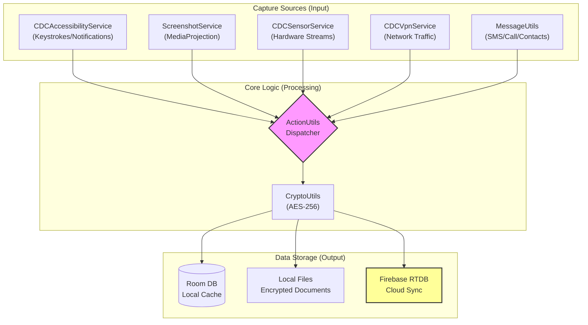
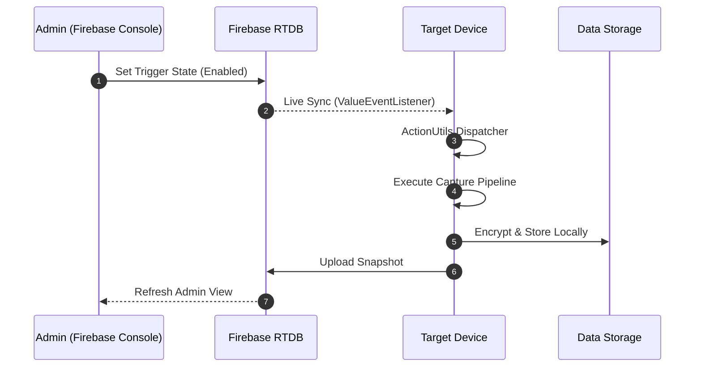
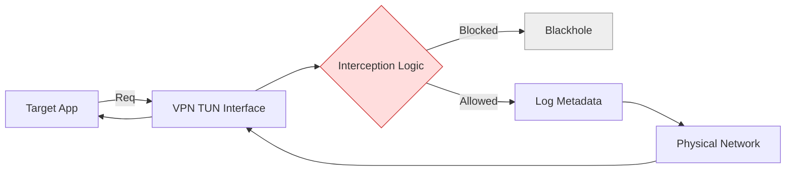
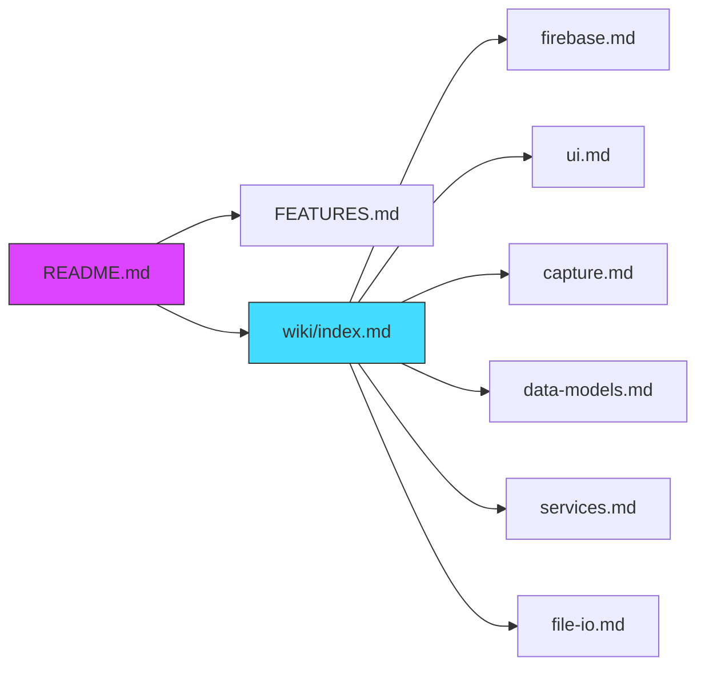

# CDC — Comprehensive Device Capture

<p align="center">
  
  
  
  
</p>

**CDC** is a sophisticated, multi-purpose Android surveillance and monitoring framework designed for secure data capture, remote control, and real-time synchronization. Built with a robust Java backend, it leverages **Firebase Realtime Database** for cloud management and **Room SQLite** for local resilience.

---

## 🚀 Key Features

| Feature | Description | Technical Implementation |
| :--- | :--- | :--- |
| **Keystroke Logging** | Captures real-time text input across all applications. | `CDCAccessibilityService` |
| **Notification Capture** | Intercepts notification extras, content, and metadata. | `AccessibilityUtils` |
| **App Usage Tracking** | Monitors foreground application sessions and durations. | `UsageStatsManager` |
| **Remote Triggers** | 14+ remote-controllable actions via Firebase cloud messaging. | `ClickActions` Enum |
| **Secure Storage** | AES-256-CBC encrypted local logs in `Documents/CDC/`. | `CryptoUtils` |
| **Admin Viewer** | Gesture-gated panel to browse captured feeds from any device. | `SettingsFragment` |
| **VPN Interception** | Intelligent traffic filtering and app-based blocking. | `CDCVpnService` |
| **Sensor Logging** | Continuous background recording of device sensor streams. | `CDCSensorService` |

---

## 🏗️ High-Level Architecture



---

## 🔄 The Control Loop (Remote Triggers)



---

## 🛡️ VPN Interception Flow



## 📂 Documentation Ecosystem



---

## 📂 Documentation Index

Dive deeper into the project with our detailed documentation:

*   📖 **[Architecture Guide](docs/ARCHITECTURE.md)**: Technical breakdown of components and data flows.
*   ⚙️ **[Setup & Deployment](docs/SETUP.md)**: Guide for Firebase integration and building the APK.
*   🛡️ **[Permissions Overview](docs/PERMISSIONS.md)**: Detailed mapping of required Android permissions.
*   🕵️ **[Admin Viewer Guide](docs/ADMIN_VIEWER.md)**: How to access and use the remote monitoring interface.
*   🔥 **[Firebase Schema](docs/firebase-schema.md)**: Data structure reference for RTDB.
*   ✅ **[Feature Catalog](FEATURES.md)**: Exhaustive list of implemented capabilities.

---

## 🛠️ Quick Start

### Prerequisites
*   **Android Studio** (Hedgehog or newer)
*   **Java 17**
*   **Firebase Account** with a Realtime Database instance.

### Installation
1.  **Clone the Repository**:
    ```bash
    git clone https://github.com/your-repo/cdc.git
    ```
2.  **Add Firebase Configuration**:
    Place your `google-services.json` in the `app/` directory.
3.  **Build & Run**:
    Open the project in Android Studio and deploy to a physical device (API 24+).
4.  **Grant Permissions**:
    Access the hidden Settings panel (3 long-presses on the Home button) to initiate permission requests.

---

## 🔄 Remote Updates
CDC supports seamless Over-the-Air (OTA) updates. Admins can push new APKs directly through Firebase Storage or any external URL.

*   Check the **[Setup Guide](docs/SETUP.md#remote-updates)** for usage instructions of the `scripts/firebase_update.ps1` tool.

---

## ⚠️ Legal Disclaimer
*This tool is intended for educational and authorized testing purposes only. The developers assume no liability for misuse or damage caused by this software.*

---
<p align="center">© 2024 CDC Project Team</p>
