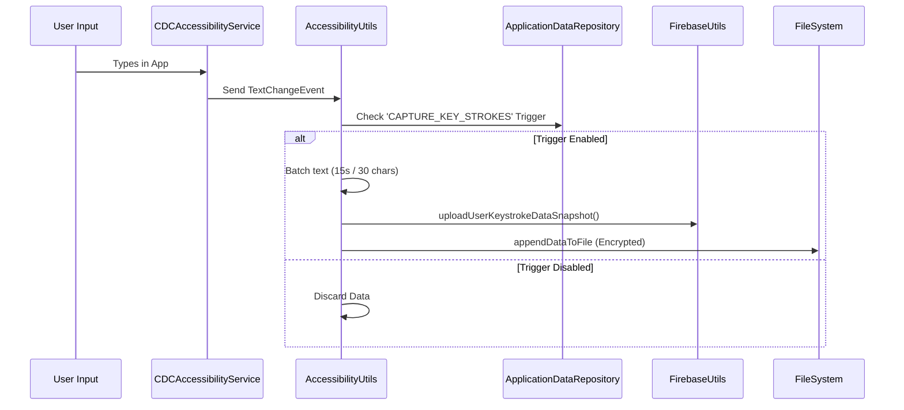

# CDC System Architecture

This document provides a technical deep-dive into the architecture of the Comprehensive Device Capture (CDC) application.

## 🏛️ Core Components

The application is structured into four primary layers, ensuring modularity and resilience even in offline scenarios.

### 1. Capture Layer (Services)
Continuous monitoring and event-driven data collection.

*   **`CDCAccessibilityService`**: The heart of the capture system. It monitors `TYPE_VIEW_TEXT_CHANGED` for keystrokes, `TYPE_NOTIFICATION_STATE_CHANGED` for notification payloads, and `TYPE_WINDOW_STATE_CHANGED` for real-time app usage tracking.
*   **`ScreenshotService`**: Utilizes the `MediaProjection` API to capture visual state. It runs as a foreground service to maintain persistence.
*   **`CDCSensorService`**: Interfaces with the `SensorManager` to log streams from the Accelerometer, Gyroscope, and other hardware sensors.
*   **`CDCVpnService`**: Establishes a local TUN interface to intercept, log, and filter IP traffic.
*   **`MyFirebaseMessagingService`**: Handles push triggers and command execution via `WorkManager`.

### 2. Logic & Routing Layer (Utils & Enums)
Orchestrates data flow based on remote and local trigger configurations.

*   **`ActionUtils`**: Dispatches tasks based on trigger events.
*   **`ClickActions` Enum**: Defines the capabilities of the system. Each entry contains a `BiConsumer` handler that executes the specific logic for that action (e.g., starting a service, requesting permissions).
*   **`CryptoUtils`**: Handles AES-256-CBC encryption for all sensitive data before it hits the storage layer.

### 3. Storage Layer
Triple-redundant storage strategy.

*   **Firebase RTDB**: Live synchronization of triggers (`appSettings`) and data snapshots (`userDeviceData`).
*   **Room SQLite**: Local database storing mirrored trigger settings and metadata, ensuring the app works without an internet connection.
*   **Filesystem**: Encrypted raw logs stored in `Documents/CDC/` using a buffered appending system (`CDCUnorganisedFileAppender`).
*   **Firebase Storage**: Holds captured media such as screenshots, camera snapshots, and audio recordings.

### 4. Presentation Layer (Admin & User UI)
Dual-purpose UI for both device registration and remote monitoring.

*   **`MainActivity`**: Handles initial user registration and permission flows.
*   **Admin Panels**: Fragment-based viewers (`KeyStrokesFragment`, `AccessibilityNotificationFragment`, etc.) that query the RTDB for the selected target device.

---

## 🔄 Data Flow: Keystroke Capture Example

---

## ⚡ Trigger System

The system is entirely remote-controlled. The `AppTriggerSettingsData` model defines how a capture source behaves:

| Field | Effect |
| :--- | :--- |
| `enabled` | Master switch for the specific capture source. |
| `interval` | Timing for repeating actions (e.g., screenshot frequency). |
| `saveOnLocalFile` | Whether to persist to the device's internal storage. |
| `uploadDataSnapshot`| Whether to push the data to Firebase RTDB. |
| `deleteLocalData` | Self-cleanup mechanism after successful upload. |

---

## 🔒 Security & Encryption

Sensitive data (Keystrokes, SMS, Calls, Contacts) is never stored in plain text locally. 

*   **Algorithm**: AES-256-CBC
*   **Key/IV**: Managed via `AppConstants` (Static implementation).
*   **Implementation**: `CryptoUtils.getEncryptedData(data)`
*   **Transport**: All cloud communication is handled via Firebase's secure SSL/TLS channels.

---
[Return to README](../README.md)
