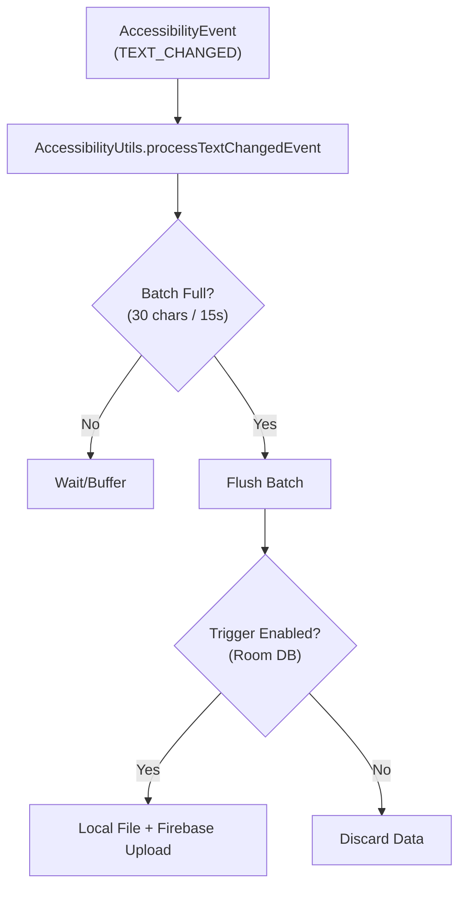
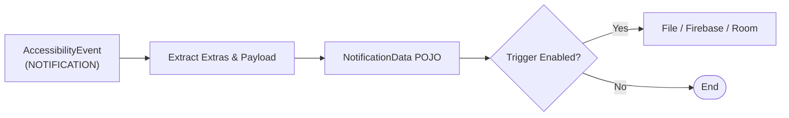
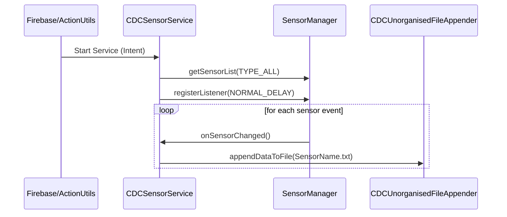
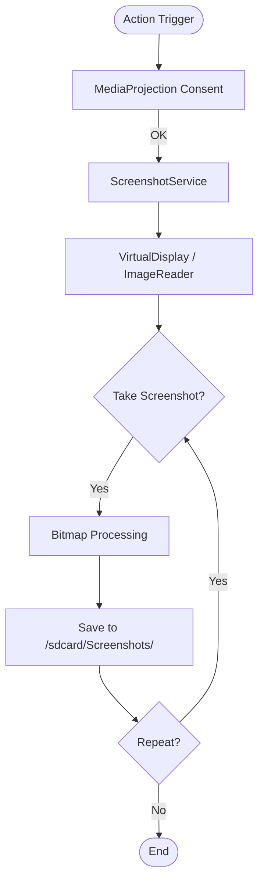

# Data Capture Pipeline

CDC captures data through four parallel channels: the Accessibility Service (keystrokes, notifications, app-open/close), the Sensor Service (hardware sensors), the Screenshot Service (screen capture), and direct content-provider queries (SMS, contacts, call logs). All channels write to local files and/or upload directly to Firebase RTDB depending on per-action settings.

## Key Classes

| Class | Responsibility |
|-------|---------------|
| `CDCAccessibilityService` | `AccessibilityService`; dispatches events to `AccessibilityUtils` and tracks per-app session times |
| `AccessibilityUtils` | Batches keystroke events (max 30 or 15-second timer); processes notification events; writes/uploads both |
| `CDCSensorService` | Foreground service; registers every non-uncalibrated sensor and streams timestamped readings to per-sensor `.txt` files |
| `ScreenshotService` | `MediaProjection`-based foreground service; captures a full-resolution PNG on demand |
| `AppUsageStats` | Queries `UsageStatsManager` for the current day's FOREGROUND/BACKGROUND events; builds an `AppUsageReportData` map |
| `CDCNotificationListenerService` | `NotificationListenerService` (supplementary to accessibility-based capture) |
| `CallUtils` | Registers a `PhoneStateListener` to track IDLE / RINGING / OFFHOOK transitions |
| `MessageUtils` | Reads SMS (`Telephony.Sms`), call logs (`CallLog.Calls`), contacts (`ContactsContract`) via `ContentResolver` |
| `FileUtils` | Routes a data object to `CDCOrganisedFileAppender` or `CDCUnorganisedFileAppender` based on `FileMap.isOrganized` |

---

## Accessibility Capture Channel

`CDCAccessibilityService` receives three event types from the Android framework:

### 1. Keystroke / Text Change Events



### 2. Notification Events



### 3. Window State / App Session Tracking

```
AccessibilityEvent (TYPE_WINDOW_STATE_CHANGED)
        │
CDCAccessibilityService.processWindowStateMovement(packageName)
        │
        ├── on app open: records startTime in appStartTimes map
        ├── on app close: computes usageTime, accumulates in appUsageTimes
        └── logs "App opened/closed" lines to FileMap.APPLICATION_USAGE

ResetService (ACTION_APPLICATION_RESET_USAGE)
        ├── CDCAccessibilityService.printDailyUsageStatic()  → writes daily summary to file
        └── CDCAccessibilityService.resetUsageDataStatic()   → clears all in-memory maps
```

---

## Sensor Capture Channel



Sensor data is written directly to individual sensor files without batching or Firebase upload. There is a TODO comment noting that a SQLite local store is planned.

---

## Screenshot Capture Channel



`ScreenshotService` creates a `VirtualDisplay` backed by an `ImageReader`. The static flag `takeScreenshot` is polled inside the `onImageAvailable` callback. Multiple screenshots can be triggered in a loop using `maxRepetitions` and `interval` from `AppTriggerSettingsData`.

---

## Content-Provider Capture (SMS / Contacts / Call Logs)

```
ClickActions.CAPTURE_ALL_SMS / CAPTURE_ALL_CONTACTS / CAPTURE_ALL_CALL_LOGS
        │ (trigger from Firebase or SettingsFragment button)
        │
MessageUtils.getMessages(context, FileMap)
        │
        ├── CALL     → ContentResolver.query(CallLog.Calls.CONTENT_URI,  DATE DESC)
        ├── SMS      → ContentResolver.query(Telephony.Sms.CONTENT_URI,  DATE DESC)
        └── CONTACTS → ContentResolver.query(ContactsContract.Contacts,  LAST_UPDATED DESC)
                              + nested phone-number query if HAS_PHONE_NUMBER > 0
        │
        ├── if saveOnLocalFile  → FileUtils.appendDataToFile(fileMap, data)
        │         └── CDCOrganisedFileAppender.checkAndAppendDataInOrganizedFile()
        │               ├── deduplicates by _id
        │               └── optionally encrypts each line via CryptoUtils
        └── if uploadDataSnapshot → FirebaseUtils.upload*DataSnapshot(list)
```

---

## App Usage Statistics Channel

```
ClickActions.GET_APP_USAGE_STATISTICS_REPORT (enabled via Firebase trigger)
        │
AppUsageStats.getDailyUsageStats(context)
        │
UsageStatsManager.queryEvents(midnight, now)
        │ (MOVE_TO_FOREGROUND / MOVE_TO_BACKGROUND events)
        │
Map<packageName, AppUsageReportData>
        │
collectAppUsageReportData()
        ├── if uploadDataSnapshot → FirebaseUtils.uploadApplicationUsageReportDataSnapshot(map)
        └── DeviceDataRepository.insert(DeviceData)
```

---

## Capture Enablement Guards

Every capture path checks the corresponding `ClickActions` entry in Room (`ApplicationDataRepository.getRecordByKey()`) before writing or uploading. This means:

1. The Firebase live-listener (`getAppTriggerSettingsData`) mirrors the remote trigger map into Room on every change.
2. Capture utilities read from Room (not Firebase) at capture time — allowing offline operation.
3. Each trigger has independent `saveOnLocalFile` and `uploadDataSnapshot` boolean flags.