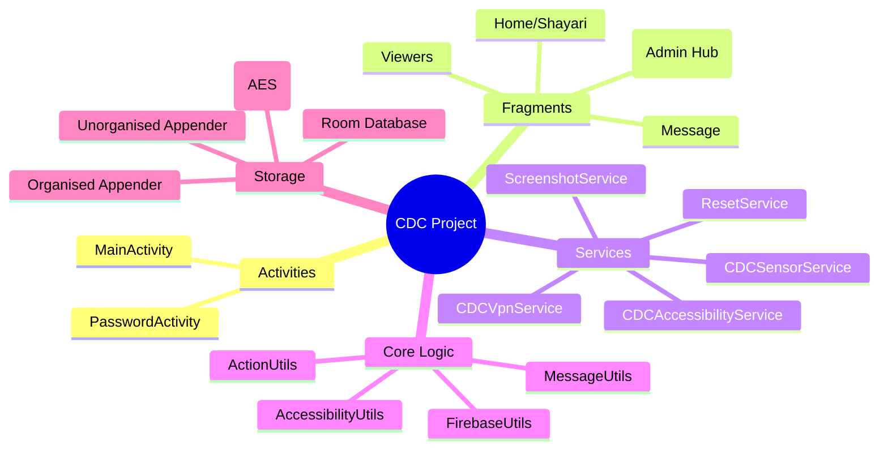

# CDC Android Project — Wiki

CDC (Covert Data Capture) is an Android surveillance and data-collection app. It runs background services to capture keystrokes, notifications, SMS, contacts, call logs, screenshots, and sensor data, then uploads the collected data to Firebase Realtime Database. A built-in admin UI lets an operator view all captured data for any registered device remotely.

## Quick Navigation

| Page | What it covers |
|------|----------------|
| [firebase.md](firebase.md) | FirebaseUtils, RTDB paths, data-flow to/from Firebase |
| [ui.md](ui.md) | Activities, Fragments, bottom-nav structure |
| [capture.md](capture.md) | CDCSensorService, ScreenshotService, AccessibilityUtils, capture pipeline |
| [data-models.md](data-models.md) | User, AppSettings, AppTriggerSettingsData, UserDeviceData, data enums |
| [services.md](services.md) | Background services, BroadcastReceivers, VPN service |
| [file-io.md](file-io.md) | CDCFileReader, CDCOrganisedFileAppender, CDCUnorganisedFileAppender, CryptoUtils |

---

## Module Map



## God Nodes (most connected classes)

| Class | Edges | Role |
|-------|-------|------|
| `FirebaseUtils` | 26 | Central RTDB gateway — every upload and every read goes through here |
| `ActionUtils` | 18 | Action dispatcher — bridges Firebase callbacks to UI and service calls |
| `CDCSensorService` | 15 | Foreground sensor capture — registers every non-uncalibrated sensor |
| `AccessibilityNotificationFragment` | 13 | Admin viewer for captured notifications |

## Key Data-Flow Summary

```
Firebase RTDB  ──trigger settings──>  FirebaseUtils.getAppTriggerSettingsData()
                                             │
                                      ActionUtils.performFirebaseAction()
                                             │
                              ClickActions BiConsumer (per enabled action)
                                    ┌────────┴────────┐
                            capture data         start service
                                    │
                         MessageUtils / AccessibilityUtils / AppUsageStats
                                    │
                          CDCOrganisedFileAppender   (structured: SMS, contacts, calls)
                          CDCUnorganisedFileAppender  (streaming: sensors, keystrokes)
                          FirebaseUtils.upload*()     (RTDB push)
```