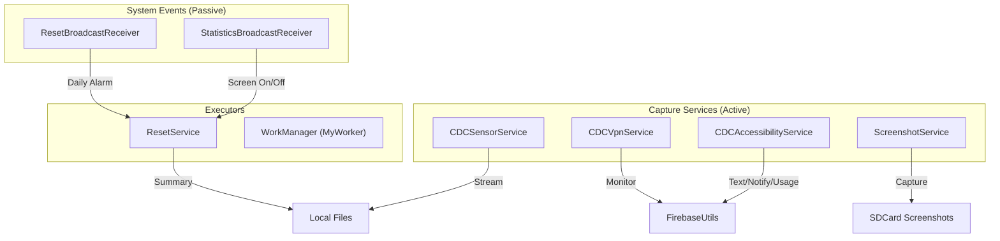

# Background Services and Receivers

CDC keeps data flowing even when the UI is closed through a set of foreground services, a VPN service, scheduled workers, and broadcast receivers. All long-running services are declared in `AndroidManifest.xml` with the required permissions.

## Key Classes

| Class | Type | Responsibility |
|-------|------|---------------|
| `CDCAccessibilityService` | `AccessibilityService` | Intercepts UI events system-wide; tracks app sessions, keystrokes, notifications |
| `CDCSensorService` | `Service` (foreground) | Registers all device sensors; streams readings to per-sensor files |
| `ScreenshotService` | `Service` (foreground) | Holds a `MediaProjection` session; captures PNGs on demand |
| `CDCVpnService` | `VpnService` | Intercepts raw IP packets (currently logs to logcat only) |
| `AppUsageStats` | Utility class | Queries `UsageStatsManager`; builds and uploads daily usage report |
| `ResetService` | `Service` (one-shot) | Handles screen-lock/unlock counters and daily usage data reset |
| `CDCNotificationListenerService` | `NotificationListenerService` | Supplementary notification capture at the system level |
| `MyFirebaseMessagingService` | `FirebaseMessagingService` | Handles FCM push token registration |
| `MyWorker` | `Worker` (WorkManager) | General-purpose background worker task |
| `ScheduledWorker` | `Worker` (WorkManager) | Periodic scheduled worker task |
| `ResetBroadcastReceiver` | `BroadcastReceiver` | Forwards `ACTION_APPLICATION_RESET_USAGE` alarm to `ResetService` |
| `StatisticsBroadcastReceiver` | `BroadcastReceiver` | Listens to ~20 system broadcasts; currently routes screen-on/off to `ResetService` |
| `DeviceAdminReceiver` | `DeviceAdminReceiver` | Receives device-admin policy events (lock, wipe, etc.) |

---

## CDCAccessibilityService

**Start condition:** User must grant accessibility permission via `Settings > Accessibility`. `AccessibilityUtils.startAccessibilitySettingIntent()` opens the settings screen if not already enabled.

**Event dispatch:**

| Event type | Handler |
|-----------|---------|
| `TYPE_VIEW_TEXT_CHANGED` | `AccessibilityUtils.processTextChangedEvent()` |
| `TYPE_VIEW_TEXT_SELECTION_CHANGED` | `AccessibilityUtils.processTextChangedEvent()` |
| `TYPE_WINDOW_STATE_CHANGED` | `processWindowStateMovement()` — app session tracking |
| `TYPE_NOTIFICATION_STATE_CHANGED` | `AccessibilityUtils.processNotificationEvent()` |

**App session tracking (internal):**
- `appStartTimes`: `Map<packageName, startEpochMs>`
- `appUsageTimes`: `Map<packageName, accumulatedMs>`
- `appOpenCounts`: `Map<packageName, count>`
- Reset daily via `resetUsageDataStatic()` called from `ResetService`

---

## CDCSensorService

Runs as a foreground service with a persistent notification ("System Service — Everything is up to date").

**Startup flow:**
1. `CDCSensorService.startSensorService(activity)` sends `ACTION=START_SENSOR` intent.
2. `onCreate()`: acquires `SensorManager`, calls `startListeningToSensors()`, creates notification channel, calls `startForeground()`.
3. `startListeningToSensors()`: iterates `sensorManager.getSensorList(TYPE_ALL)`, skips sensors whose name contains `"uncalibrated"`, registers each remaining sensor with `SENSOR_DELAY_NORMAL`.

**Data path:**
```
onSensorChanged(event)
  └── CDCUnorganisedFileAppender.appendDataToFile(
           "<SensorName>.txt",
           "Timestamp: <ns>, Values: <v1>, <v2>, ...")
      → stored at: /sdcard/Documents/CDC/Sensors/<SensorName>.txt
```

No Firebase upload for sensor data. Sensor readings accumulate in individual files per sensor type.

**Stop flow:** `stopSensorService(activity)` sends `ACTION=STOP_SENSOR`; `onStartCommand` calls `stopListeningToSensors()` which calls `sensorManager.unregisterListener(this)`.

---

## ScreenshotService

Runs as a foreground service; requires `MediaProjection` consent granted through a system dialog.

**State machine:**

| ActionStatus | What happens |
|-------------|-------------|
| `PREPARE` | `ActionUtils.startMediaProjectionService()` → system consent dialog |
| `START` | `ScreenshotService.setTakeScreenshot(true)` → triggers capture on next `onImageAvailable` |
| `STOP` | `ScreenshotService.setStopScreenshotService(true)` → releases resources and stops self |

**Capture path:**
```
takeScreenshot()
  ├── ImageReader.newInstance(screenWidth, screenHeight, RGBA_8888, 2)
  ├── mediaProjection.createVirtualDisplay(...)
  └── onImageAvailable()
        └── if takeScreenshot == true → processImage() → saveBitmap()
                    └── /sdcard/Screenshots/screenshot_<timestamp>.png
```

Multiple screenshots can be burst-captured by setting `maxRepetitions > 1` with a configurable `interval` ms delay between each shot (via `AppTriggerSettingsData`).

---

## CDCVpnService

Extends `VpnService`. Builds a TUN interface routing all device traffic (`0.0.0.0/0` and `::/0`). Intercepts and parses raw IP packets.

- **Intelligent Blocking**: 
  - **App-level**: Apps added to `vpnConfig.restrictedApps` are routed to a black-hole tunnel, disabling their internet access across all connectivity types (Wi-Fi, SIM, USB).
  - **Domain-level**: Inspects DNS queries globally. If a query matches `vpnConfig.restrictedWebsites`, it is logged as a blocked attempt.
- **Traffic Monitoring**: Captures metadata (protocol, source/destination IP, identified service, packet size) for all non-blocked traffic and uploads it to Firebase (`userDeviceData/vpnTraffic`).
- **Data Cap**: Automatically trims Firebase logs to the last 50 entries to manage storage.

Started/Stopped remotely via `CONTROL_VPN_SERVICE` ClickAction or `ActionUtils.startVpnService()`.

---

## ResetService

A one-shot `Service` (returns `START_NOT_STICKY`) that handles three actions:

| Intent action | Effect |
|--------------|--------|
| `ACTION_SCREEN_ON` | Increments `unlockCount`, appends to `FileMap.APPLICATION_USAGE` |
| `ACTION_SCREEN_OFF` | Increments `lockCount`, appends to `FileMap.APPLICATION_USAGE` |
| `ACTION_APPLICATION_RESET_USAGE` | Calls `CDCAccessibilityService.printDailyUsageStatic()` + `.resetUsageDataStatic()`, then reschedules via `CommonUtil.scheduleDailyReset()` |

---

## ResetBroadcastReceiver

Registered statically in `AndroidManifest.xml` to receive `ACTION_APPLICATION_RESET_USAGE` (a custom PendingIntent alarm). It simply forwards the intent to `ResetService` as a started service.

```
AlarmManager fires custom broadcast
        │
ResetBroadcastReceiver.onReceive()
        │
context.startService(new Intent(context, ResetService.class)
        .setAction(ACTION_APPLICATION_RESET_USAGE))
```

---

## StatisticsBroadcastReceiver

Registered dynamically by `ActionUtils.registerPhoneStatistics(activity)` (triggered by `ClickActions.MONITOR_PHONE_STATISTICS`). Listens to ~20 system broadcasts:

| Currently handled | Action |
|-------------------|--------|
| `ACTION_SCREEN_ON` | → `ResetService` (screen-on) |
| `ACTION_SCREEN_OFF` | → `ResetService` (screen-off) |
| `ACTION_PACKAGE_REMOVED` | logs package name (debug only) |
| All others (BOOT, AIRPLANE, POWER, BT, etc.) | logs action string (debug only) |

---

## AppUsageStats (utility, not a Service)

Not a service class — it is called imperatively when `GET_APP_USAGE_STATISTICS_REPORT` is enabled. Requires `PACKAGE_USAGE_STATS` permission (checked via `hasUsageStatsPermission()`).

```
AppUsageStats.getDailyUsageStats(context)
  ├── UsageStatsManager.queryEvents(midnight, now)
  ├── builds Map<packageName, AppUsageReportData>
  └── collectAppUsageReportData()
        ├── FirebaseUtils.uploadApplicationUsageReportDataSnapshot()
        └── DeviceDataRepository.insert()
```

---

## WorkManager Workers

| Worker | Purpose |
|--------|---------|
| `MyWorker` | General-purpose one-off or periodic task (implementation details in source) |
| `ScheduledWorker` | Periodic background task; likely triggers usage-stat collection or file-upload cycles |

---

## Service Interaction Map



---
