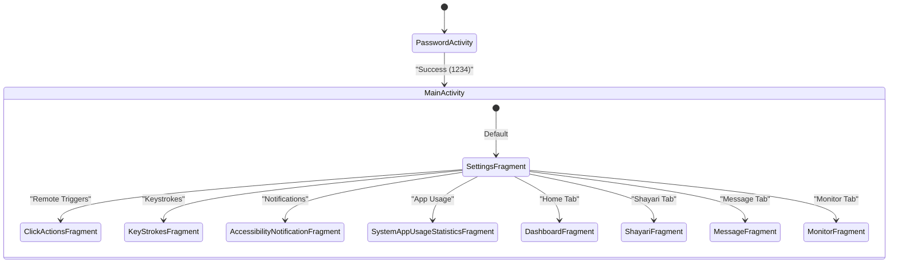
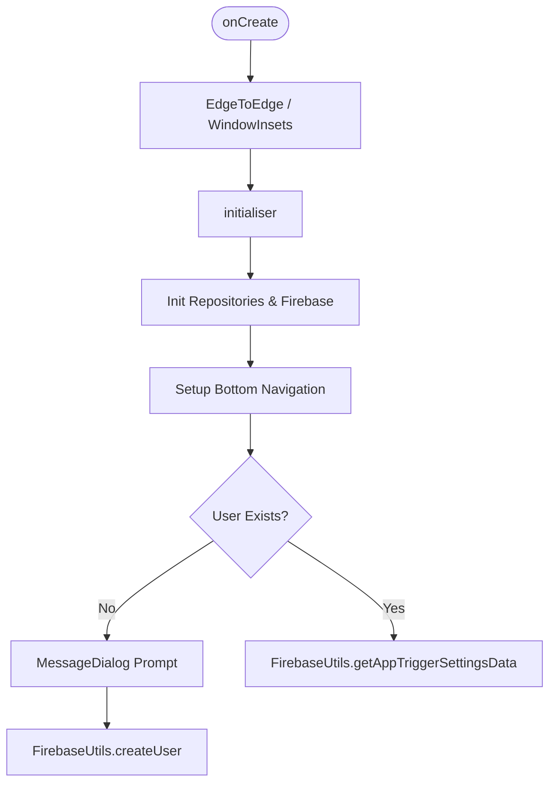

# UI — Activities, Fragments, and Navigation

CDC uses a single-Activity architecture. `MainActivity` hosts a `BottomNavigationView` with five tabs; each tab swap loads a `Fragment` into a shared container. An admin sub-flow (device selector + viewer fragments) is pushed onto the back stack from `SettingsFragment`.

## Key Classes

| Class | Responsibility |
|-------|---------------|
| `MainActivity` | Single host activity; initialises Firebase, repositories, DI, and bottom nav |
| `PasswordActivity` | Gate screen shown before `MainActivity` (password check) |
| `DashboardFragment` | Home tab — currently a layout-only placeholder |
| `ShayariFragment` | Displays a round-robin shayari fetched from `cdc/shayari/` in RTDB |
| `MessageFragment` | Displays an operator-set personalised message from `cdc/users/<id>/message` |
| `MonitorFragment` | Live monitoring tab — currently a layout-only placeholder |
| `SettingsFragment` | Admin hub: device-selector spinner, admin-viewer tiles, and action tiles |
| `ClickActionsFragment` | Renders the selected device's `appTriggerSettingsDataMap` as editable buttons |
| `KeyStrokesFragment` | Displays captured keystrokes (from Firebase) grouped by date |
| `AccessibilityNotificationFragment` | Displays captured notifications (from Firebase) filterable by app package |
| `SystemAppUsageStatisticsFragment` | Displays daily app-usage report from Firebase |
| `OfflineClickActionsFragment` | Runs `ClickActions` directly on the local device (no remote user required) |
| `CommonUtil` | `loadFragment()` / `loadFragmentWithBackStack()` helpers used by all navigation calls |

---

## Navigation Structure



Bottom-nav selection calls `CommonUtil.loadFragment(getSupportFragmentManager(), fragment)`, which replaces the fragment container without adding to the back stack. Viewer tiles in `SettingsFragment` use `CommonUtil.loadFragmentWithBackStack()` so the back button returns to Settings.

---

## MainActivity Lifecycle



`onActivityResult()` is forwarded to `ActionUtils.onActivityResult()`, which handles the MediaProjection consent result (request code `3000`) and starts `ScreenshotService`.

`onRequestPermissionsResult()` is forwarded to `PermissionHandler.handlePermissionResult()` (injected via Hilt from `MyModule`).

---

## SettingsFragment Layout

`SettingsFragment` inflates `fragment_settings.xml`, which contains:

1. **Device selector spinner** (`settings_fragment_dropdown_spinner`) — populated by `FirebaseUtils.getFlatUserDetails()` → `ActionUtils.performFlatUserDetailsActions()` → `SettingsFragment.populateUserDropdown()`. Selecting a device calls `FirebaseUtils.setSelectedUser(androidId)`.

2. **Admin viewer grid** (`admin_viewers_grid`) — five `ViewerTile` cards defined in the static `VIEWER_TILES` array:

   | Icon | Title | Fragment opened | Requires device |
   |------|-------|----------------|-----------------|
   | 📱 | Remote Triggers | `ClickActionsFragment` | yes |
   | ⌨ | Keystrokes | `KeyStrokesFragment` | yes |
   | 🔔 | Notifications | `AccessibilityNotificationFragment` | yes |
   | 📊 | App Usage | `SystemAppUsageStatisticsFragment` | yes |
   | 🔌 | Local Actions | `OfflineClickActionsFragment` | no |

   Tiles requiring a device show a toast if none is selected.

3. **Action tiles grid** (`fragment_layout`) — one tile per `ClickActions` enum value (sorted by `order`). Each tile's button invokes `action.getBiConsumer().accept(activity, settings)` directly.

---

## Hilt DI

`MainActivity` is annotated `@AndroidEntryPoint`. `MyModule` (singleton scope) provides:
- `PermissionHandler` → `PermissionManager` instance
- `ActionUtils` → `ActionUtils` instance

These are injected into `MainActivity` via `@Inject`.

---

## Fragment Relationships (data flow)

```
ShayariFragment      ← ActionUtils.performShayariAction()     ← FirebaseUtils.getShayariCollection()
MessageFragment      ← ActionUtils.performMessageAction()      ← FirebaseUtils.getMessageData()
SettingsFragment     ← ActionUtils.performFlatUserDetailsActions() ← FirebaseUtils.getFlatUserDetails()
ClickActionsFragment ← ActionUtils.getAndUpdateAndroidUserClickActions() ← FirebaseUtils.getAndroidUserClickActions()
KeyStrokesFragment   ← ActionUtils.displayAndroidUserKeystrokes()  ← FirebaseUtils.getAndroidUserKeystrokes()
AccessibilityNotificationFragment ← ActionUtils.displayAndroidUserAccessibilityNotification()
SystemAppUsageStatisticsFragment  ← ActionUtils.displaySystemAppUsageStatisticsReportData()
```

All fragment update methods are static to allow `ActionUtils` (which only holds an `Activity` reference) to call them without needing a fragment manager lookup.